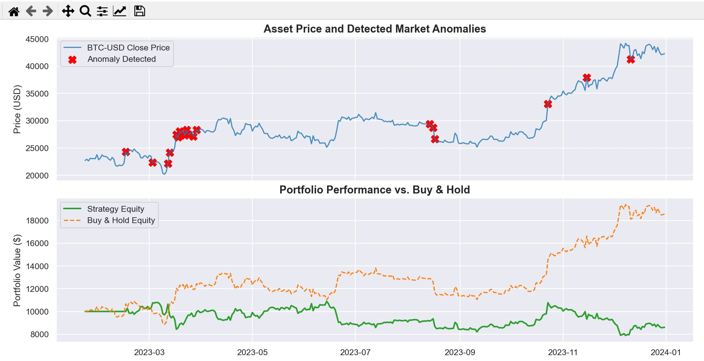

# Algorithmic Trading Backtester & Market Anomaly Predictor 📈

A modular, Object-Oriented quantitative trading pipeline built in Python. This system ingests historical market data, identifies pricing anomalies using Machine Learning (Isolation Forests) and statistical models and backtests custom trading strategies to evaluate risk-adjusted returns.



## 🏗️ Architecture
The system is designed with production-readiness in mind, separating concerns into distinct modules:
* `data_loader.py`: Fetches and cleans multi-year OHLCV data via the `yfinance` API, handling missing values and calculating baseline rolling features.
* `anomaly_detector.py`: Utilizes Scikit-learn's `IsolationForest` to flag extreme volatility and price deviations.
* `strategies.py`: Contains a base strategy class and specific implementations, including a Dual Moving Average Crossover and an ML-driven "Anomaly Fader".
* `backtester.py`: A vectorized backtesting engine that simulates trading execution, applies transaction fees (0.1%), and tracks portfolio equity.
* `metrics.py`: Calculates core quantitative risk metrics (Sharpe Ratio, Maximum Drawdown, Win Rate).

## 🚀 Installation & Usage

1. **Clone the repository**
```bash
git clone [https://github.com/mdaftab09/algo-backtester-capstone.git](https://github.com/mdaftab09/algo-backtester-capstone.git)
cd algo-backtester-capstone
```

2. **Install dependencies**
```bash
pip install -r requirements.txt
```

3. **Run the pipeline**
```bash
python main.py
```

## 🔮 Future Enhancements
* Implement slippage models to account for liquidity constraints.
* Add out-of-sample data testing to prevent overfitting and survivorship bias.
* Integrate live data streaming via WebSockets.
